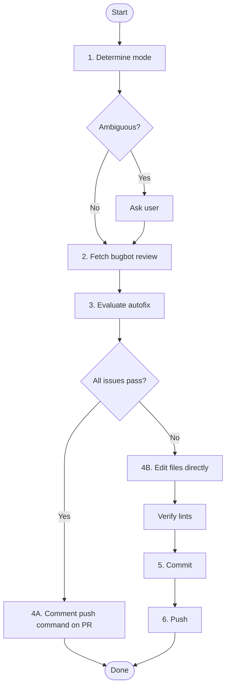

# PR Bugfix

Triage Cursor Bugbot comments on a GitHub PR, evaluate the autofix, apply the best available fix, and push.

## Workflow Overview



---

## Detailed Steps

### 1. Determine mode

<mandatory-gate>
This step is NOT optional. You MUST determine mode before fetching the review or touching any files.
</mandatory-gate>

Ask the user (or infer from their message) whether to operate in:
- **Autonomous** — apply and push without approval
- **Approval** — show proposed changes and wait for a thumbs-up before committing

Trigger words that imply autonomous: "fix and push", "just fix it", "go ahead", "auto-fix".
Trigger words that imply approval: "show me", "let me review", "check with me", "propose".

<ambiguity-rule>
If the user's message contains NO trigger words (e.g. they just passed a PR URL), that is ambiguous — you MUST use the `AskQuestion` tool with two options:

- "Apply and push directly (autonomous)"
- "Show me the changes first (approval)"

A bare `/pr-bugfix <url>` with no qualifiers is always ambiguous. Do not infer autonomous from brevity.
</ambiguity-rule>

### 2. Fetch bugbot review

```bash
gh api repos/<owner>/<repo>/pulls/<number>/reviews
```

Parse the response for the `cursor[bot]` review. Extract:
- Each issue title and description (from `BUGBOT_AUTOFIX_COMPLETION` block)
- The autofix diff (inside the `<details><summary>Preview …</summary>` block)
- The push command: `` @cursor push <sha> `` (if present)

### 3. Evaluate the autofix

For each issue, read the affected files and reason through the diff:

| Question | Action |
|---|---|
| Is the fix logically correct? | If no → write your own fix |
| Does it introduce style/lint drift vs surrounding code? | If yes → clean it up |
| Is there a more durable abstraction available (shared util, existing pattern)? | If yes → prefer that |
| Does the diff touch the right scope (not too broad / not too narrow)? | If no → write your own fix |

If **all issues pass** the evaluation → go to **Step 4A**.
If **any issue fails** → go to **Step 4B** for that issue only; use the autofix for the rest.

### 4A. Apply fixes — autofix

<use-autofix>
When the autofix passes evaluation, use the push comment — do NOT re-implement the changes manually.
Manual re-implementation when the autofix is correct is wasted effort and risks introducing drift.
</use-autofix>

In **approval** mode, summarize the autofix findings (one line per issue: what it fixes and why it's correct), then use the `AskQuestion` tool to confirm before pushing. Only proceed once the user confirms.

In **autonomous** mode, push immediately by commenting on the PR:
```bash
gh pr comment <number> --repo <owner>/<repo> --body "@cursor push <sha>"
```

Then skip to **Done** — no commit or push step needed, the bot handles it.

### 4B. Apply fixes — own changes

<only-use-when>
Only take this path when you have a concrete reason the autofix is wrong or insufficient for a specific issue.
"I want to double-check the formatting" is NOT a concrete reason. "The autofix uses a local reimplementation where a shared util exists" IS a concrete reason.
</only-use-when>

Apply changes directly to the working branch using file edit tools, then verify with lints.

### 5. Commit

Use the `/commit` skill to stage and commit.

Suggested commit type/scope: `fix(calendar)` or appropriate scope.

### 6. Push

```bash
git push
```

<approval-mode-gate>
In **approval** mode, show a brief text summary of what was changed and why, plus the proposed commit message in a plain-text code block. The user can see the diff in their git viewer — don't repeat it. Use the `AskQuestion` tool to ask for confirmation before committing and pushing.
</approval-mode-gate>

## Tips

- Always read the affected files before evaluating a diff — the autofix may be correct but miss project conventions (import order, shared utilities, naming).
- Check `nameToInitials`, `formatDate`, and other shared utils in `src/lib/format.ts` before accepting a local reimplementation in an autofix.
- If bugbot found 2+ issues, evaluate and apply them independently; don't let one bad fix block a correct one.
- After pushing, note the issue titles and confirm the PR branch is up to date.
