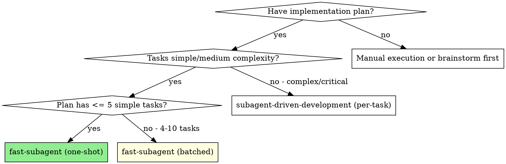
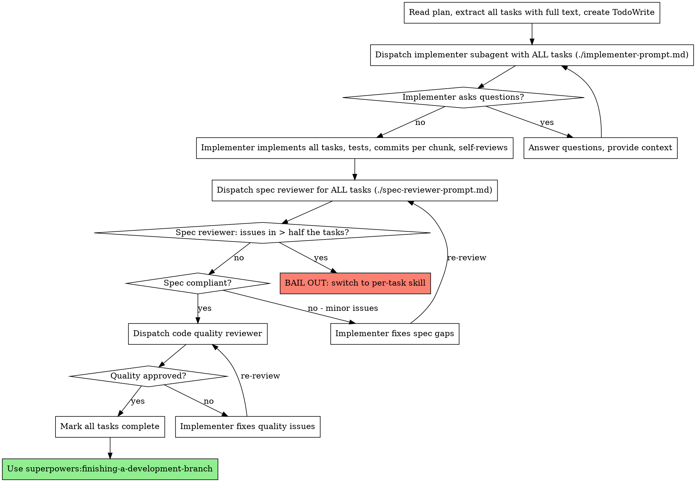
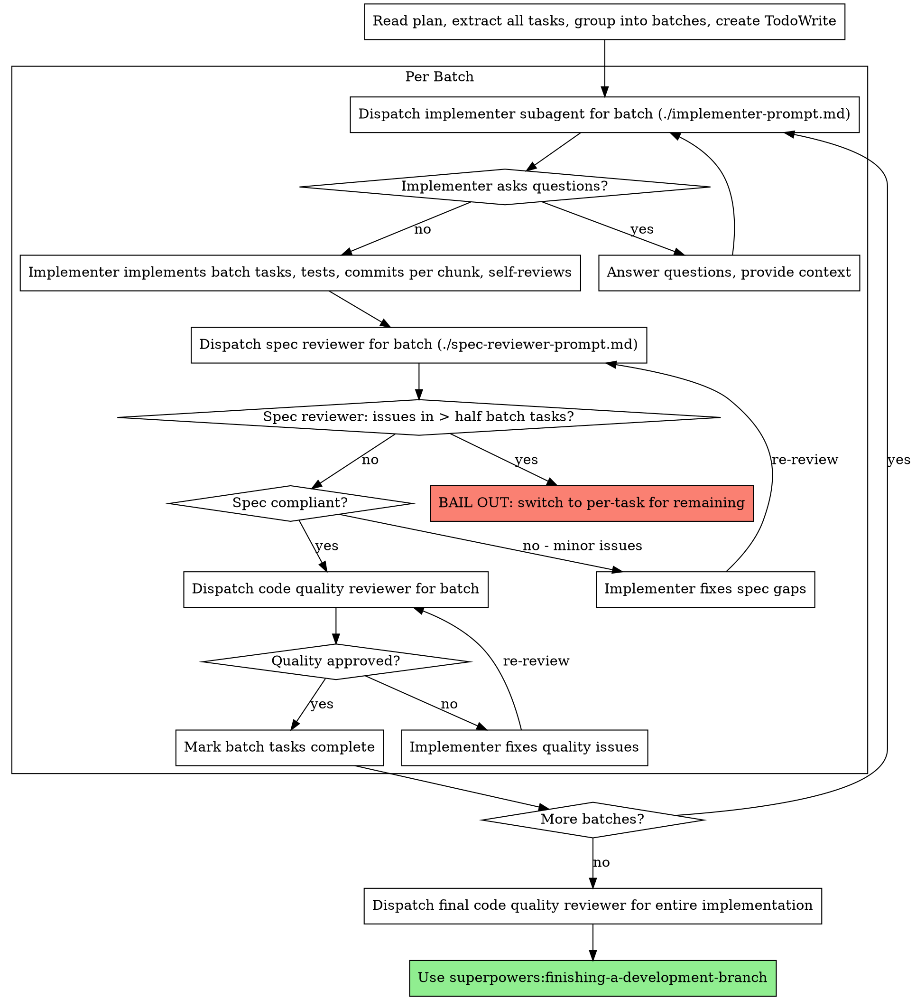

# Fast Subagent-Driven Development

Execute plan by grouping tasks into batches (or one shot) and dispatching fewer, larger subagent invocations with reviews per batch instead of per task.

**Core principle:** Fewer subagent round-trips = faster execution. Trade per-task review granularity for speed while keeping the two-stage review discipline.

## When to Use



**vs. subagent-driven-development (per-task):**

- Same two-stage review discipline (spec then quality), but per batch not per task
- Fewer subagent invocations (3 for one-shot, ~N for batched vs 3N+ for per-task)
- Controller batches tasks by logical grouping (module, dependency, cohesion)
- Bail-out rule: if reviews find widespread issues, fall back to per-task

## Mode Selection

| | One-Shot | Batched | Per-Task (original skill) |
|---|---|---|---|
| Plan size | 2-5 tasks | 4-10 tasks | Any |
| Task complexity | Low | Medium | High |
| Quality criticality | Lower | Medium | High |
| Speed priority | Highest | High | Lower |
| Subagent invocations | 3 total | ~N total | 3N+ |
| Review granularity | Whole plan | Per batch | Per task |

## Mode Selection (User Chooses)

After the user selects fast mode, present the two sub-options with your recommendation:

**"Fast mode selected. Two sub-options:**

**1. One-Shot** - Single subagent implements the entire plan, reviews once at the end. Fastest. Best for <=5 simple tasks.

**2. Batched** - I group tasks into logical batches (2-4 tasks each), one subagent per batch, reviews per batch. Good for 4-10 tasks or when you want some review granularity.

**I'd recommend [one-shot/batched] because [reason]. Which do you prefer?"**

Use this table when forming your recommendation:

| | One-Shot | Batched |
|---|---|---|
| Best for | 2-5 simple tasks | 4-10 tasks |
| Task complexity | Low | Medium |
| Speed | Fastest | Fast |
| Review granularity | Whole plan | Per batch |
| Risk if issues found | Higher (broad fix scope) | Moderate (batch-scoped fixes) |

**Fall back to per-task when:** complex tasks, tightly specified requirements, quality-critical, or fast mode reviews surface too many issues.

## One-Shot Mode

Single implementer for the entire plan, then reviews once at the end.



## Batched Mode

Controller groups tasks into logical batches, one implementer per batch, reviews per batch.



## Batching Heuristics

The controller decides how to group tasks. Good batches share:

- **Same module/directory** -- tasks touching the same files or package
- **Dependency chain** -- DAO + service + route for the same entity
- **Logical cohesion** -- related config changes, related schema migrations
- **Similar complexity** -- don't mix a trivial rename with a complex algorithm

**Batch size:** 2-4 tasks per batch. More than 4 makes reviews unwieldy.

**Example:** A plan with 7 tasks:
- Batch 1: Tasks 1-3 (add User DAO, service, route)
- Batch 2: Tasks 4-5 (add permissions, middleware)
- Batch 3: Tasks 6-7 (add tests, docs)

## Bail-Out Rule

If the spec reviewer finds issues in **more than half** the tasks in a batch (or in the whole plan for one-shot):

1. **Stop** -- don't loop fixes
2. **Flag it** -- "Fast mode is producing too many spec mismatches"
3. **Fall back** -- switch to `superpowers:subagent-driven-development` (per-task) for remaining work
4. **Already-completed batches stay** -- only remaining tasks switch to per-task

This prevents expensive fix loops on work that was fundamentally misunderstood.

## Prompt Templates

- `./implementer-prompt.md` -- Dispatch implementer subagent (works for both modes)
- `./spec-reviewer-prompt.md` -- Dispatch spec compliance reviewer (reviews multiple tasks)
- Code quality reviewer uses the same template as the original skill: `../subagent-driven-development/code-quality-reviewer-prompt.md`

## Example: One-Shot Workflow

```
You: I'm using Fast Subagent-Driven Development (one-shot) to execute this plan.

[Read plan: 4 simple tasks - add DAO, service, route, tests]
[All tasks straightforward, well-understood domain -> one-shot mode]
[Create TodoWrite with all 4 tasks]

[Dispatch single implementer with all 4 tasks]

Implementer: [No questions, proceeds]
Implementer:
  - Implemented User DAO with CRUD operations
  - Added UserService with business logic
  - Created /users route with all endpoints
  - Wrote 12 tests, all passing
  - Made 4 atomic commits (one per task)
  - Self-review: All clean

[Dispatch spec reviewer for all 4 tasks]
Spec reviewer:
  - Task 1 (DAO): ✅ All CRUD operations present
  - Task 2 (Service): ✅ Business logic matches spec
  - Task 3 (Route): ✅ All endpoints implemented
  - Task 4 (Tests): ✅ Coverage matches requirements
  Result: ✅ Spec compliant

[Dispatch code quality reviewer with base/head SHAs]
Code reviewer: Strengths: Clean, well-tested. Issues: None. Approved.

[Mark all tasks complete]
Done! 3 subagent invocations total.
```

## Example: Batched Workflow

```
You: I'm using Fast Subagent-Driven Development (batched) to execute this plan.

[Read plan: 8 tasks across auth and billing modules]
[Group into batches by module:]
  Batch 1: Tasks 1-3 (auth: DAO, service, middleware)
  Batch 2: Tasks 4-6 (billing: DAO, service, webhooks)
  Batch 3: Tasks 7-8 (integration tests, docs)
[Create TodoWrite with all 8 tasks]

Batch 1: Auth module
[Dispatch implementer with Tasks 1-3]
Implementer: Implemented auth DAO, service, middleware. 3 commits. All tests pass.
[Spec review] ✅ All 3 tasks compliant
[Code quality review] ✅ Approved
[Mark Tasks 1-3 complete]

Batch 2: Billing module
[Dispatch implementer with Tasks 4-6]
Implementer: Implemented billing DAO, service, webhooks. 3 commits.
[Spec review] ❌ Task 5 missing retry logic, Task 6 has extra endpoint
[Fix loop - 2 issues in 3 tasks, below bail-out threshold]
[Implementer fixes, spec reviewer re-reviews] ✅
[Code quality review] ✅ Approved
[Mark Tasks 4-6 complete]

Batch 3: Tests and docs
[Dispatch implementer with Tasks 7-8]
...

[After all batches: final code quality review]
[finishing-a-development-branch]
```

## Example: Bail-Out

```
Batch 2: [Dispatch implementer with Tasks 4-6]
[Spec review] ❌ Task 4 wrong approach, Task 5 missing half the requirements, Task 6 OK
  -> 2 of 3 tasks have issues (> half)
  -> BAIL OUT

"Fast mode produced too many spec mismatches in this batch (2/3 tasks).
Switching to per-task mode (superpowers:subagent-driven-development) for Tasks 4-8."

[Continue with per-task skill for remaining tasks]
```

## Red Flags

**Never:**

- Start implementation on main/master branch without explicit user consent
- Skip reviews (spec compliance OR code quality) -- fast mode still reviews, just less granularly
- Skip the bail-out check after spec review
- Use one-shot mode for > 5 tasks or complex/critical work
- Use batched mode with > 4 tasks per batch
- Make subagent read plan file (provide full text instead)
- Skip scene-setting context
- Let implementer make a single giant commit (still commit per logical chunk)
- **Start code quality review before spec compliance is ✅**

**Always:**

- Pick mode explicitly at the start (one-shot or batched) and announce it
- For batched: explain the batching rationale before dispatching
- Check bail-out threshold after every spec review
- Fall back to per-task gracefully when bail-out triggers
- Commit per logical chunk even in one-shot mode

**If subagent asks questions:** Answer clearly, provide context, don't rush.

**If reviewer finds issues (below bail-out):** Implementer fixes, reviewer re-reviews. Same loop discipline as per-task.

**If bail-out triggers:** Don't try to salvage -- switch to per-task for remaining work.

## Integration

**Required workflow skills:**

- **superpowers:using-git-worktrees** - REQUIRED: Set up isolated workspace before starting
- **superpowers:writing-plans** - Creates the plan this skill executes
- **superpowers:requesting-code-review** - Code review template for reviewer subagents
- **superpowers:finishing-a-development-branch** - Complete development after all tasks
- **commit** - Use when committing; generates conventional commit messages and commits staged changes locally (does not push)

**Subagents should use:**

- **superpowers:test-driven-development** - Subagents follow TDD for each task

**Alternative workflows:**

- **superpowers:subagent-driven-development** - Use for per-task review granularity (slower, more thorough)
- **superpowers:executing-plans** - Use for parallel session instead of same-session execution
