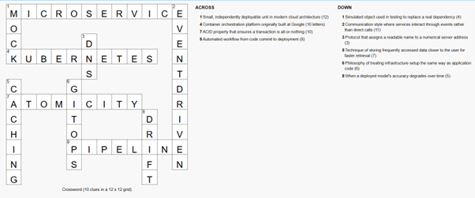

# Crossword Puzzle

•	Automated workflow from code commit to deployment (8) → PIPELINE
•	When a deployed model's accuracy degrades over time (5) → DRIFT
•	Protocol that assigns a readable name to a numerical server address (3) → DNS
•	Small, independently deployable unit in modern cloud architecture (12) → MICROSERVICE
•	Philosophy of treating infrastructure setup the same way as application code (6) → GITOPS
•	Communication style where services interact through events rather than direct calls (11) → EVENTDRIVEN
•	Technique of storing frequently accessed data closer to the user for faster retrieval (7) → CACHING
•	Simulated object used in testing to replace a real dependency (4) → MOCK
•	ACID property that ensures a transaction is all-or-nothing (10) → ATOMICITY
•	Container orchestration platform originally built at Google (10 letters) → KUBERNETES
